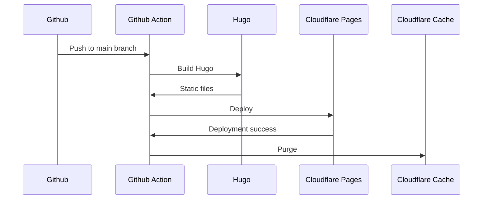

If you are like me, who obsesses with performance, you probably want enable Edge Caching for your static site. Hope you find something useful in this article. I use this pipeline for this website as well.

The diagram below shows the sequence of this action:



Let's get directly to the action.

```yaml
# .github/workflows/deploy.yml

name: Deploy to Cloudflare Pages
on:
  push:
    branches:
      - master
      - dev

jobs:
  deploy:
    name: Deploy
    runs-on: ubuntu-latest
    env:
      HUGO_CACHE_DIR: /tmp/hugo_cache
      WRANGLER_VERSION: 3.90.0
    concurrency:
      group: ${{ github.workflow }}-${{ github.ref }}
      cancel-in-progress: true
    steps:
      - uses: actions/checkout@v4
        with:
          submodules: true
          fetch-depth: 0

      - name: Setup Hugo
        uses: peaceiris/actions-hugo@v3
        with:
          hugo-version: latest
          extended: true

      - uses: actions/cache@v4
        with:
          path: ${{ env.HUGO_CACHE_DIR }}
          key: ${{ runner.os }}-hugomod-${{ hashFiles('**/go.sum') }}
          restore-keys: |
            ${{ runner.os }}-hugomod-

      - name: Build
        run: hugo --minify

      - name: Setup Node.js
        uses: actions/setup-node@v3
        with:
          node-version: '22'

      - name: Cache wrangler
        id: wrangler-cache
        uses: actions/cache@v4
        with:
          path: ~/.npm
          key: wrangler-${{ runner.os }}-${{ env.WRANGLER_VERSION }}
          restore-keys: |
            wrangler-${{ runner.os }}-${{ env.WRANGLER_VERSION }}-

      - name: Install wrangler
        run: |
          echo "Installing wrangler version ${{ env.WRANGLER_VERSION }}"
          npm install wrangler@${{ env.WRANGLER_VERSION }}

      - name: Deploy to cloudflare
        uses: cloudflare/wrangler-action@v3
        with:
          apiToken: ${{ secrets.CLOUDFLARE_TOKEN }}
          accountId: ${{ secrets.CLOUDFLARE_ACCOUNT }}
          command: pages deploy public --project-name=blog --branch=${{ github.ref_name }}

      - name: Cloudflare cache purge
        if: github.ref_name == 'master'
        uses: jakejarvis/cloudflare-purge-action@master
        env:
          CLOUDFLARE_ZONE: ${{ secrets.CLOUDFLARE_ZONE }}
          CLOUDFLARE_TOKEN: ${{ secrets.CLOUDFLARE_TOKEN }}
```

## Notes

### Cloudflare Pages

We won't be using Cloudflare Pages automatic deployments because we can't control the cache purge after each deployment, at least at the time of writing this article. So it's recommended to use the "direct upload" option when creating the project in Cloudflare Pages, but you have to use the Wrangler CLI to do so, so you can specify the branch to be the production branch.

```bash
npx wrangler pages project create <PROJECT_NAME> --production-branch=<BRANCH_NAME>>
```

Feel free to use other options to host your Hugo site, but you will have to tweak the action to publish the files.

### Cache

You will have to add your domain to Cloudflare and enable the Cache Rules there. Just use `Cache Everything`, set `Edge TTL` to "Ignore cache-control header and use this TTL" and set the time to your liking. Since we will purge the cache after each deployment, you can set it a longer value if you want to.

### Github Action

It's quite optimized with cache for build steps. Make sure to create a Cloudflare API token with enough permissions: `Account.Cloudflare Pages.Edit` and `Zone.Cache Purge.Purge`. Save it to Github secrets along with Cloudflare account ID and zone ID.

Make sure to update `master` branch in the action if you are using a different branch for production.